# TURISMO QUITO

Ejemplo de aplicativo para fomentar el turismo en Quito implementado con Ionic and Angular

funcionamiento --> https://youtu.be/WstKUq3LVc8  
<br />

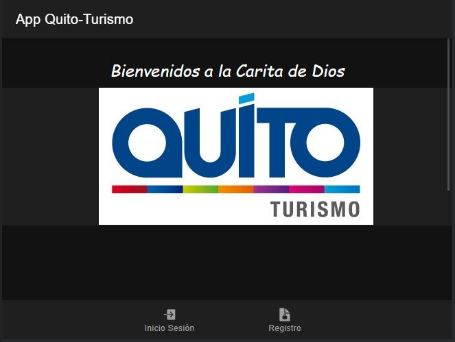
<br />

### App Ionic Angular incluye:

- Geolocation
- Routes Protection
- Ionicons
- Navigation
- Register
- Login

### To run

```javascript
npm install
ionic serve
```

<br />
Nota : Debe tener una API activa para GoogleMaps ,GoogleSheet & Firebase 
<br />

## Register

<br />
En el registro se puede elegir el rol (Turista o Propietario) 
<br />

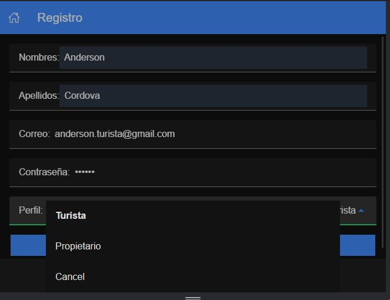
<br />

## Login

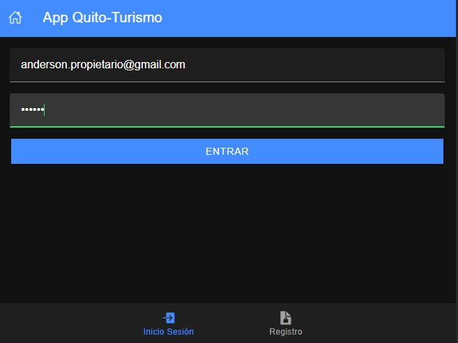
<br />

## View User Propietario

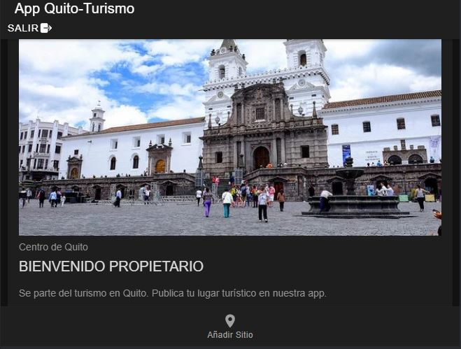

<br />
El propietario puede registrar sitios turisticos 
<br />

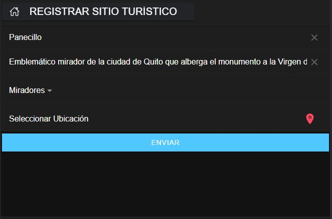

<br />
Registro de ubicacion del sitio con GooglesMaps 
<br />

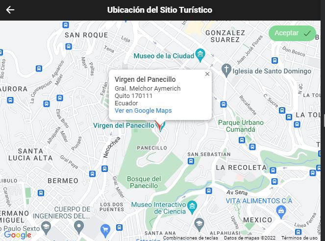
<br />

## View User Turista

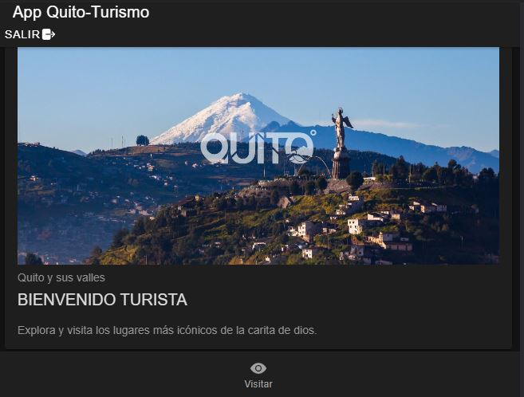

<br />
El propietario puede buscar sitios turisticos 
<br />

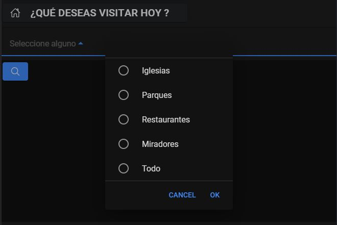

<br />

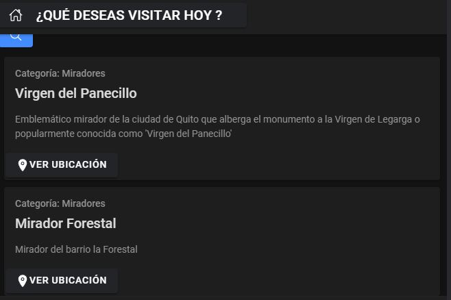

<br />
Vizualizar ubicacion el sitio con GooglesMaps 
<br />

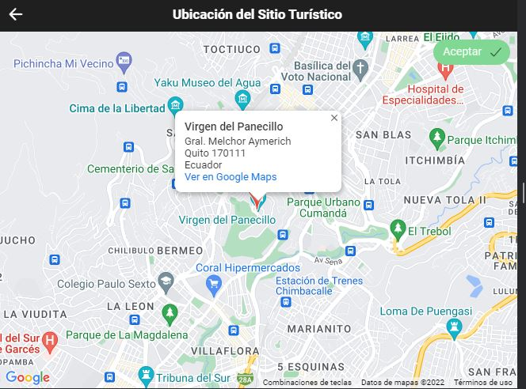
<br />

## View Admin

El admin puede realizar todas las acciones del usuario turista y propietario y más
<br />
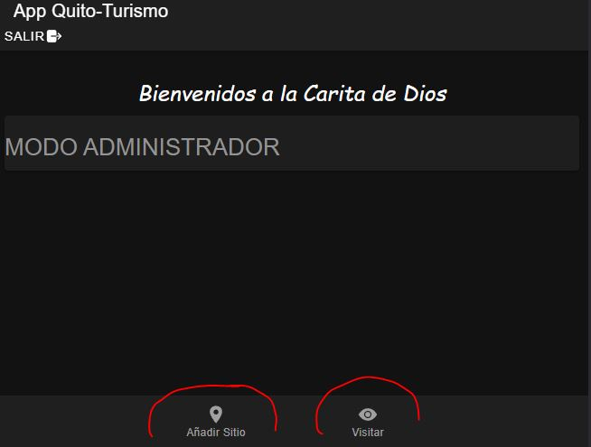

## Datos

Datos Respaldados en Firebase
<br />
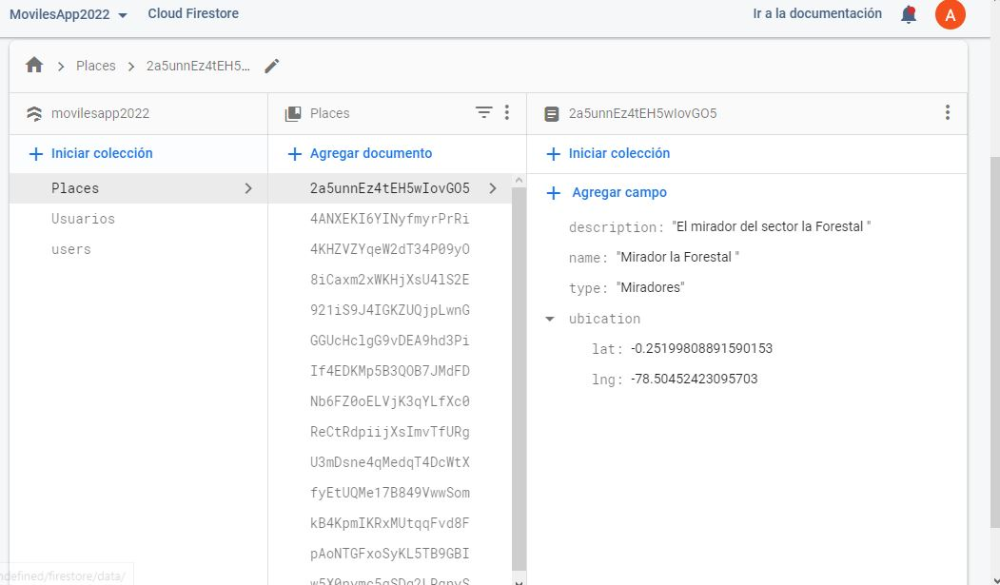

Datos Respaldados en Hoja de Cálculo de GoogleDrive
<br />
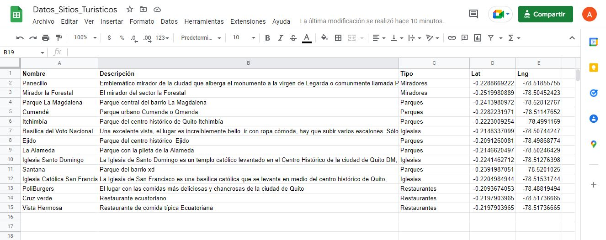
